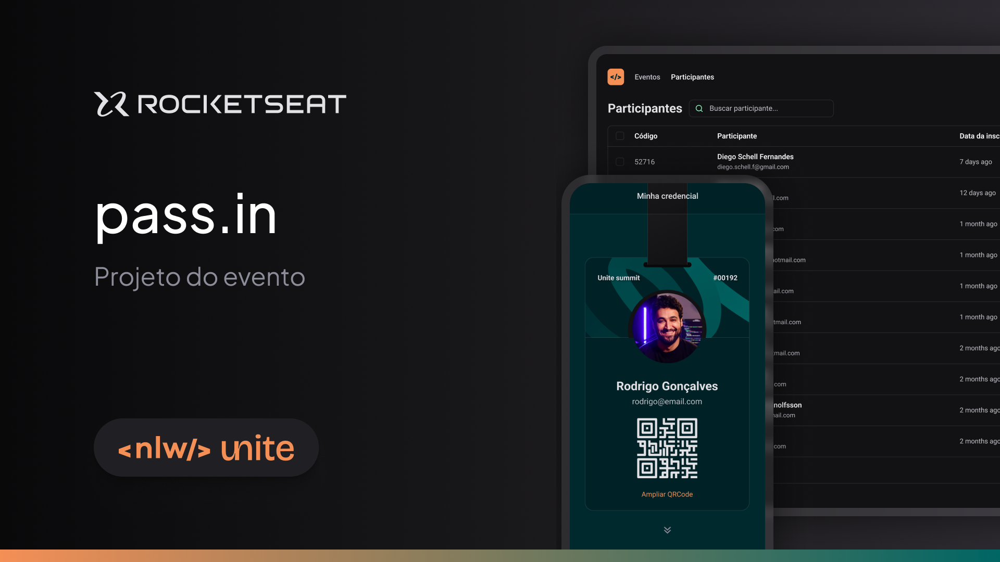
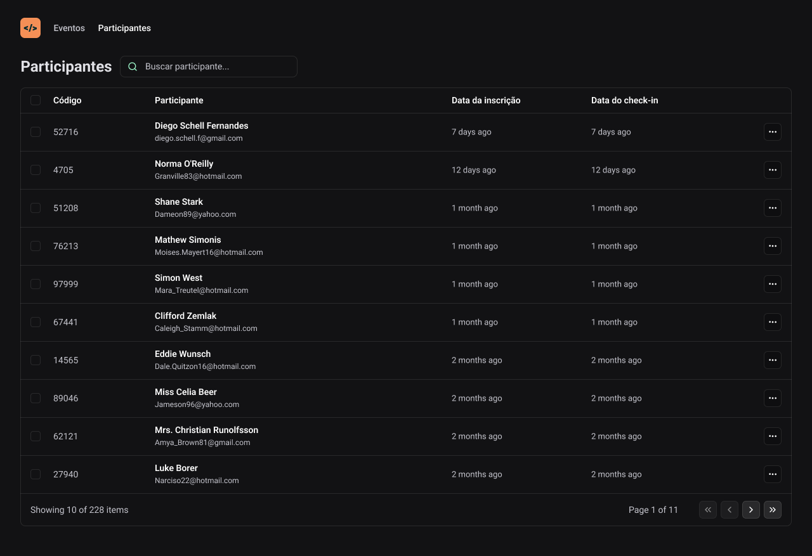

<div align="center">
    
</div>

---
## :books: Descrição

<p>
    Projeto feito durante a NLW Unite, o pass.in que foi feito na Trilha de React, tem a principal função de listar
    os usuários que foram cadastrados em um evento, trazendo suas informações e detalhes de cada um deles. O principal foco
    desse projeto, é trazer uma visão mais clean no processo de mudanças em uma URL, o que é tratado no projeto, que são os
    estados da URL ou URL States
</p>

---
## :art: Layout



---
## :gear: Techs
- Front-end
    - [ReactJS](https://reactjs.org/)
    - [Vite](https://vitejs.dev/)
    - [Tailwind](https://tailwindcss.com/)

---
## :desktop_computer: Como usar

- É necessário rodar no terminal o comando abaixo:
```
    npm run dev
```
- Para acessar a página web, abra uma aba no navegador e digite http://localhost:5173
---
## :spiral_notepad: License
Arquivos sob a licença [MIT](https://github.com/lucasgomesgp) criado por Lucas Gomes.